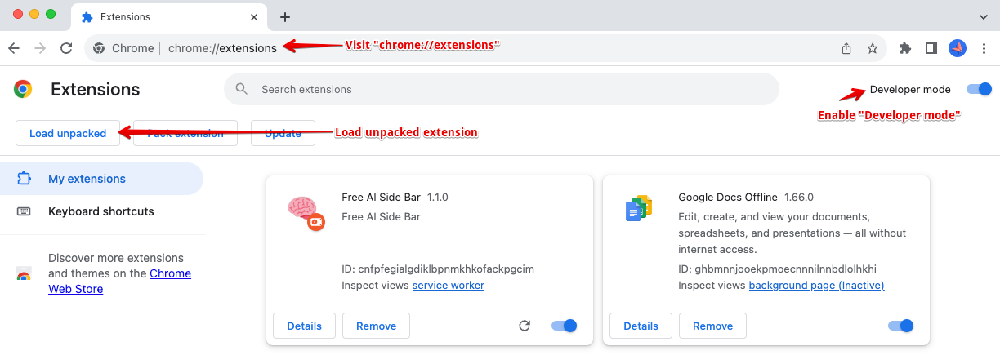

    

🤩 [Download Chrome Extension](https://chromewebstore.google.com/detail/free-ai-side-bar/bphjdepgpbodffelhponjdfpjdajghgc)

    
    

# AI Side Bar

- Chrome extension sidebar for all sort of AI things
- Community driven, open source
- OpenAI Plugin

## Features 

- Ask questions using chatGPT in chrome sidebar 

## Requirements
- Node v16>=

## Commands
- `npm i`: Install dependencies
- `npm run dev`: Start dev server 
- `npm run build`: Build the source code into './dist'
- `npm run build-watch`: Build the source code into `./dist` and continuously rebuild when changes occur
- `npm run test`: Run tests below `./src/tests` directory 

## Build and Test Chrome Extension 👨‍💻 

### Mocking Openai API 
1. Set `VITE_MOCK_OPENAI_API` to `true` in `.env` file

### Using Openai API 

1. [Login to OpenAI Account](https://platform.openai.com/login)
2. [Visit OpenAI API Keys Page](https://platform.openai.com/account/api-keys)
3. Create a new API key
4. Make sure the organization is set to 'Personal'
5. Copy the API Key
6. Run `npm i` to install the necessary dependencies
7. Run `npm run build` to build source code into `./dist` 
8. Visit [chrome extensions page](chrome://extensions/)
9. Enable developer mode 
10. Load unpacked extension(select `./dist` folder)
11. Paste API Key in OpenAI API Key input box

## Note
- By providing a personal API key the user may subject to billing
- For pricing, refer to [OpenAI's pricing policy](https://openai.com/pricing)
- API key is a secret do not share it with others
- Users should understand the [rate limits](https://platform.openai.com/account/rate-limits) that the API holds
- This extension will only work within a chrome browser

## Contributions
- Submit a pull request with a clear title and description
- [Commit message best practices](https://www.freecodecamp.org/news/how-to-write-better-git-commit-messages/)

## Contributors 
<!-- ALL-CONTRIBUTORS-BADGE:START - Do not remove or modify this section -->

<!-- ALL-CONTRIBUTORS-BADGE:END -->

<!-- ALL-CONTRIBUTORS-LIST:START - Do not remove or modify this section -->
<!-- prettier-ignore-start -->
<!-- markdownlint-disable -->
<table>
  <tbody>
    <tr>
      <td align="center" valign="top" width="14.28%"><a href="https://github.com/seonwoo960000"> <b>Kim Seon Woo</b></a> <a href="https://github.com/seonwoo960000/ai-sidebar/commits?author=seonwoo960000" title="Code">💻</a> <a href="https://github.com/seonwoo960000/ai-sidebar/commits?author=seonwoo960000" title="Documentation">📖</a></td>
      <td align="center" valign="top" width="14.28%"><a href="https://www.linkedin.com/in/rhythm-sharma-708a421a8/"> <b>Rhythm Sharma</b></a> <a href="#design-Rhythm-08" title="Design">🎨</a></td>
      <td align="center" valign="top" width="14.28%"><a href="https://github.com/CainanConway"> <b>CainanConway</b></a> <a href="https://github.com/seonwoo960000/ai-sidebar/commits?author=CainanConway" title="Documentation">📖</a></td>
      <td align="center" valign="top" width="14.28%"><a href="https://github.com/aishwarya-mali"> <b>Aishwarya Mali</b></a> <a href="#design-aishwarya-mali" title="Design">🎨</a></td>
    </tr>
  </tbody>
</table>

<!-- markdownlint-restore -->
<!-- prettier-ignore-end -->

<!-- ALL-CONTRIBUTORS-LIST:END -->
<!-- prettier-ignore-start -->
<!-- markdownlint-disable -->

<!-- markdownlint-restore -->
<!-- prettier-ignore-end -->

<!-- ALL-CONTRIBUTORS-LIST:END -->
