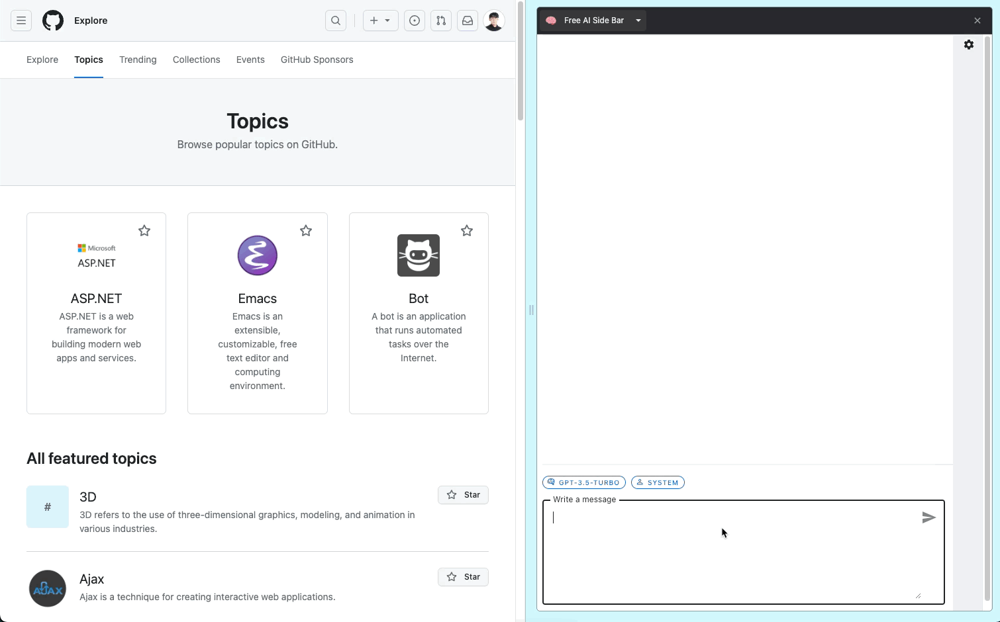

🤩 [Donwload Chrome Extension](https://chromewebstore.google.com/detail/free-ai-side-bar/bphjdepgpbodffelhponjdfpjdajghgc)

# Free AI Side Bar

- Chrome extension sidebar for all sort of AI things
- Community driven, open source

    
    

## Why should we have to pay for AI stuff?

Many AI chrome extensions require us to pay even though we provide our own api keys. Let's stop paying
and make one for ourselves.

## Features 

- Ask questions using chatGPT in chrome sidebar 

## Commands 

- `npm run dev`: Start dev server
- `npm run build`: Build the source code into './dist'
- `npm run build-watch`: Build the source code into `./dist` and continuously rebuild when changes occur
- `npm run test`: Run tests below `./src/tests` directory 

## Build and Test Chrome Extension 
1. Run `npm run build` to build source code into `./dist` 
2. Visit [chrome extensions page](chrome://extensions/)
3. Enable developer mode 
4. Load unpacked extension(select `./dist` folder)
